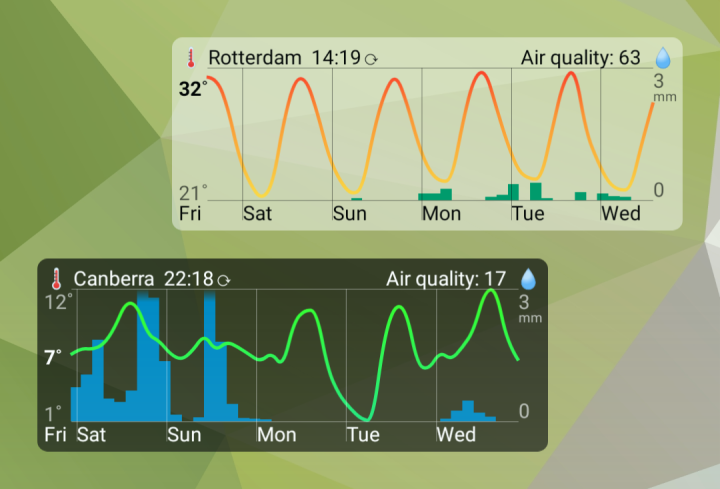
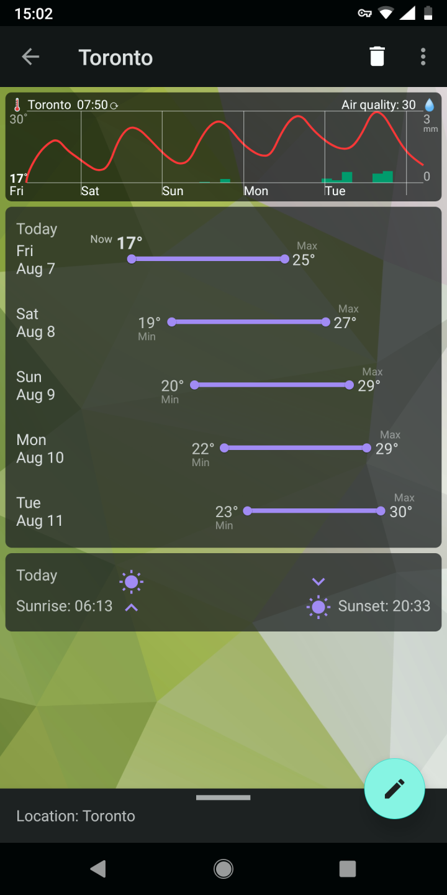
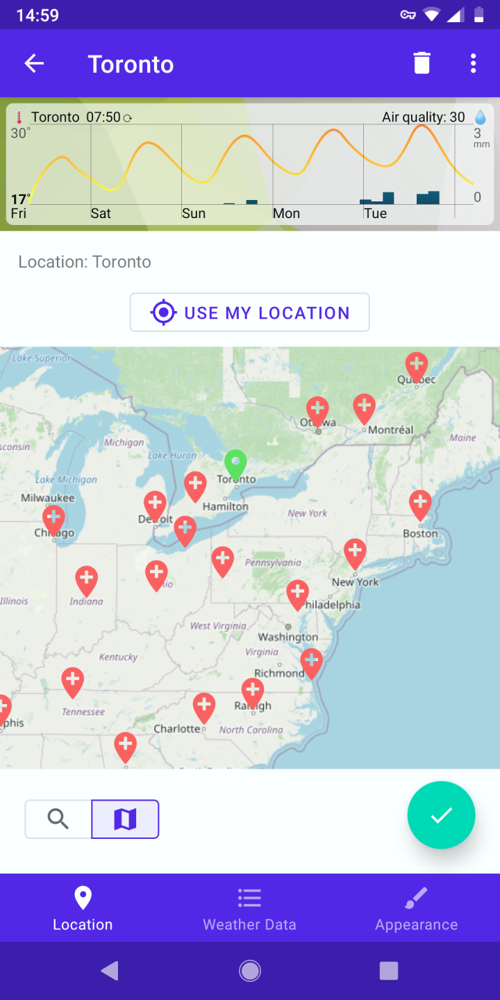
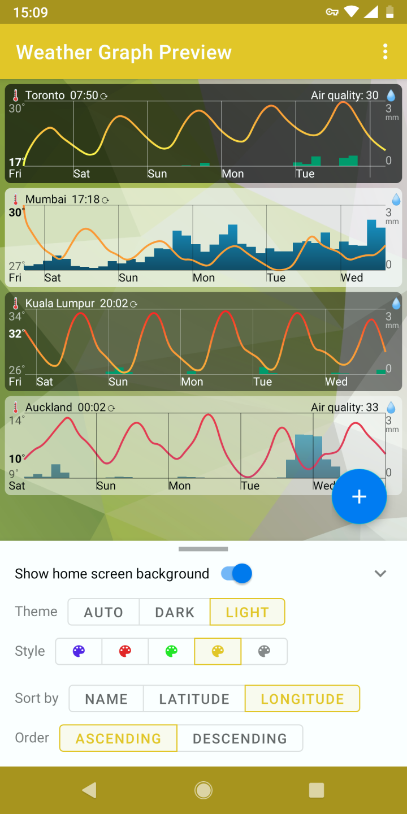
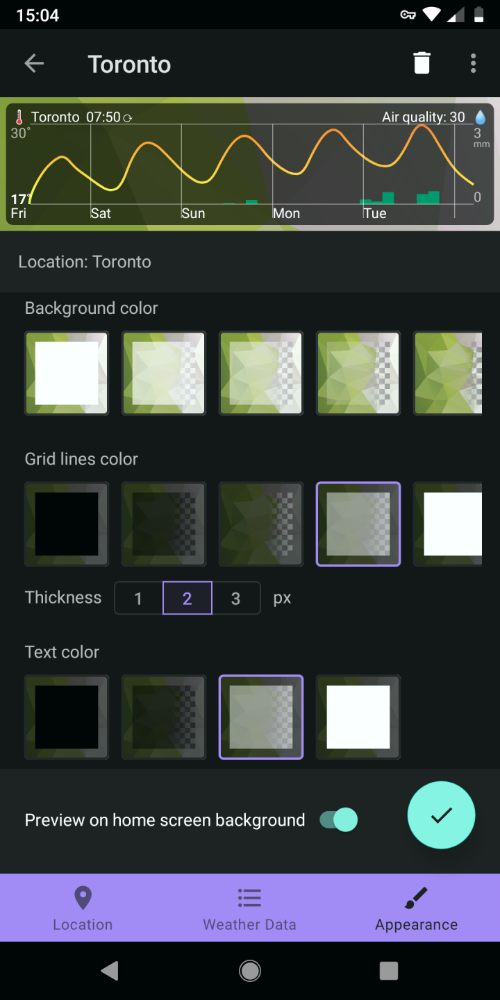

# WeatherGraph

Visual weather forecast app with home screen widgets for Android.

Weather data: from OpenWeatherMap and AQICN, with user's API keys.

[](example/example.png)

* Add widgets on Home screen, or add locations in the app.
* Search locations, pick them on the map, or use yours.
* See temperature graph & precipitation forecast for up to 5 days.
* Click graph to see today's sunrise / sunset times, and daily temperatures.
* Current (in bold) temperature shown; min / max don't overlap current. 

[](example/example2.png)
[](example/example3.png)

* View AQI air quality index, if available for location.
* Choose what to show, how often to update weather data.
* Choose app theme colors.
* Customize colors on each graph.

[](example/example4.png)
[](example/example5.png)


## Build & run

### Requirements

* Java
* Android SDK

### Source code preparation

Get the source code:

```
git clone https://github.com/alex-vt/WeatherGraph
cd WeatherGraph
```

App signing setup:

* Put your `keystore.jks` to the project's root folder for signing the app.
* Create a `signing.properties` in the project's root folder with `keystore.jks` credentials:

```
signingStoreLocation=../keystore.jks
signingStorePassword=<keystore.jks password>
signingKeyAlias=<keystore.jks alias>
signingKeyPassword=<keystore.jks key password>
```

Weather data API keys setup:

* Create an `apikey.properties` in the project's root folder:

```
OWM_API_KEY="<your OpenWeatherMap API key>"
AQICN_API_KEY="<your AQICN API key>"
```

> For OpenWeatherMap API key info, see https://openweathermap.org/api
>
> For AQICN API key info, see https://aqicn.org/api


### Run on ADB connected device:

```
./gradlew app:installRelease
```

### Build installable APK

```
./gradlew app:assembleRelease
```

Install `app/build/outputs/apk/release/app-release.apk` on Android device.


## Development

Tech stack: Kotlin / Android SDK (classic native app)

Maps: OpenStreetMap / osmdroid

Build system: Gradle


## License

[MPL 2.0](LICENSE) license.

```
This Source Code Form is subject to the terms of the Mozilla Public
License, v. 2.0. If a copy of the MPL was not distributed with this
file, You can obtain one at http://mozilla.org/MPL/2.0/
```
